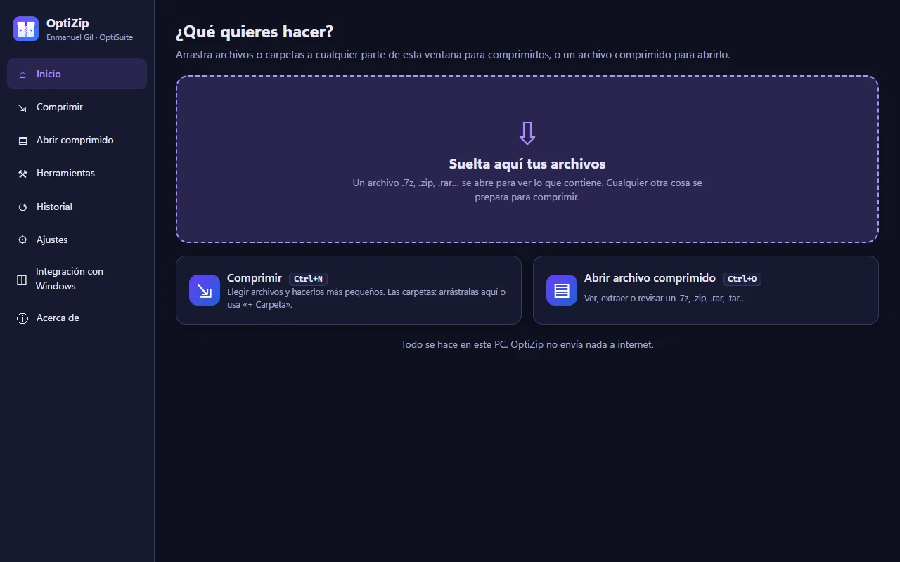
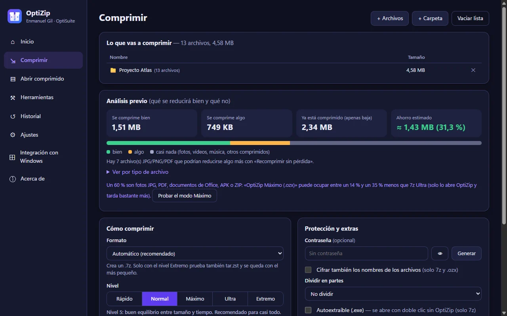
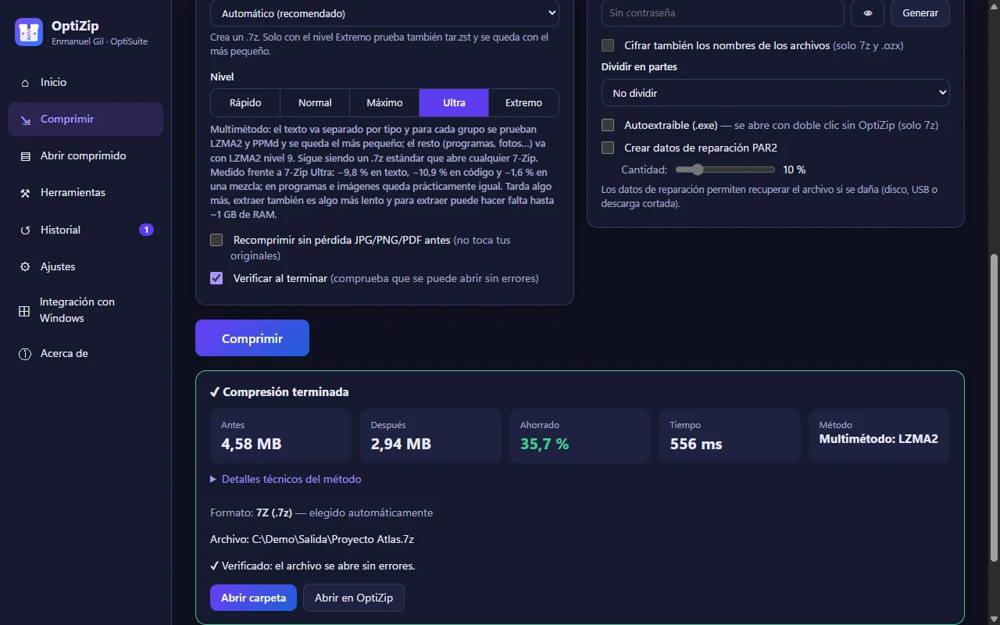
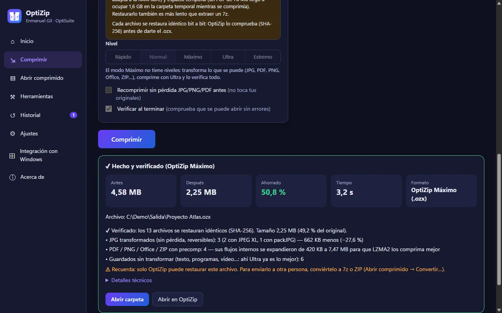
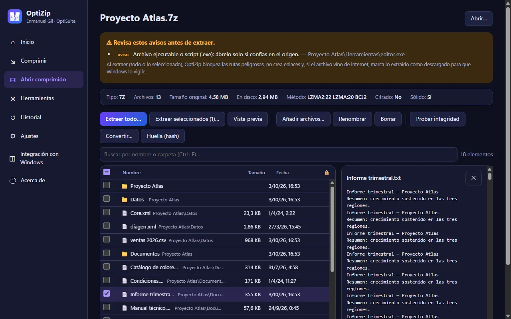
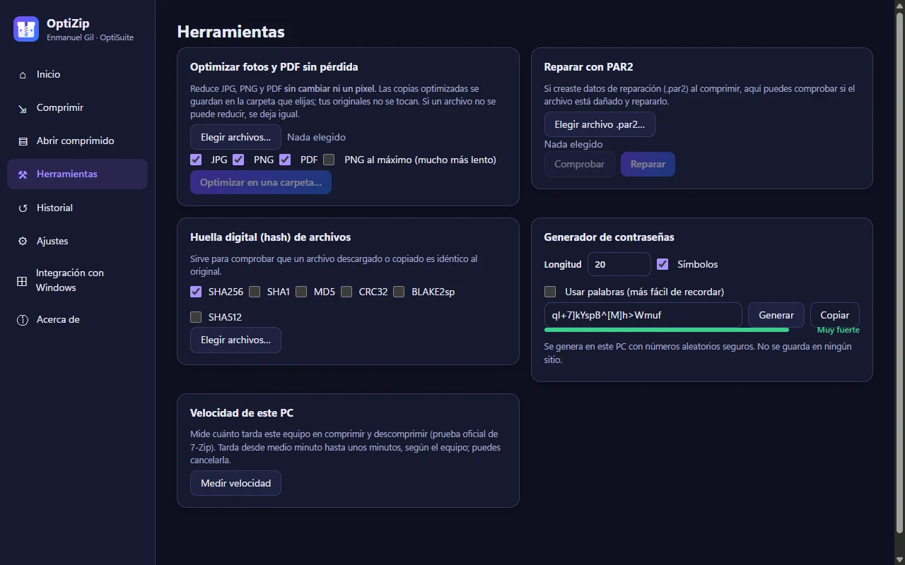
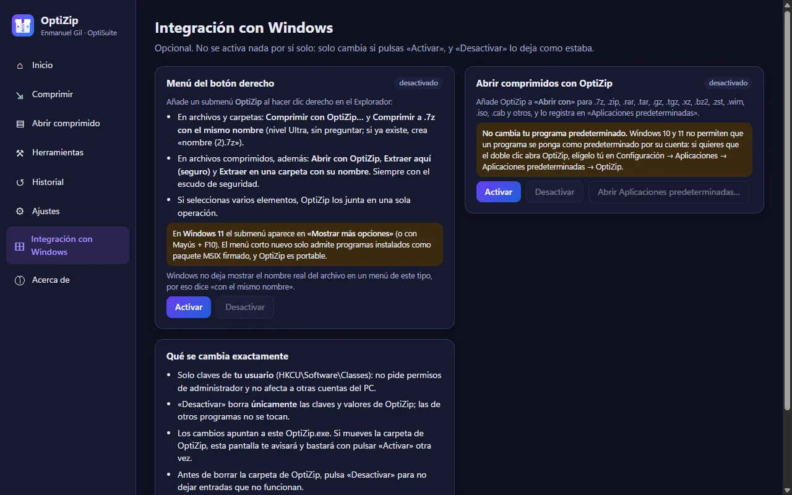

# OptiZip

&nbsp;

**Compresor y gestor de archivos comprimidos para Windows.** Crea 7z, ZIP, TAR, ZST y más; abre más de 40 formatos
(RAR incluido); cifra con AES-256; repara con PAR2 y revisa cada archivo con un escudo de seguridad antes de extraer.
**Todo se hace en tu PC, sin internet y sin telemetría.** Gratis.

Parte de la suite **[OptiSuite](https://optisuite.app/optizip/)** · Windows 10/11 (64 bits) · por Enmanuel Gil.

## Descarga

[**OptiZip-Portable.zip**](https://github.com/EnMaNueL-G/optizip/releases/latest/download/OptiZip-Portable.zip) (~144 MB, versión 1.1.0). No hace falta instalar nada.

1. Clic derecho en el ZIP → **«Extraer todo…»** (no lo abras sin extraer).
2. Abre **`OptiZip.exe`** dentro de la carpeta `OptiZip`.
3. Si Windows avisa («Windows protegió su PC»): **«Más información» → «Ejecutar de todas formas»**. El programa no está firmado con un certificado de pago.

## Qué hace

- **Comprimir** en 7z, ZIP, TAR, tar.zst, tar.xz, tar.gz, tar.bz2, WIM, ZST, GZ, XZ y BZ2. Formato «Automático» si no quieres elegir.
- **Niveles** Rápido, Normal, Máximo, **Ultra** y **Extremo**. Ultra en 7z es **multimétodo**: separa el texto por tipo, prueba LZMA2 y PPMd en cada grupo y se queda con el más pequeño. El resultado sigue siendo un **.7z estándar** que abre cualquier 7-Zip.
- **Modo Máximo (.ozx)**: transforma sin pérdida JPG (JPEG XL / packJPG), PDF, PNG, Office, APK y ZIP antes de comprimir, y guarda una sola vez los archivos repetidos. Cada archivo se restaura **idéntico byte a byte** (comprobado con SHA-256 antes de entregarte el .ozx).
- **Análisis previo**: antes de empezar te dice qué se va a reducir bien y qué no.
- **Recompresión sin pérdida** opcional de JPG/PNG/PDF antes de comprimir (no toca tus originales; los píxeles se comprueban idénticos).
- **Contraseña AES-256**, con opción de cifrar también los nombres (7z y .ozx), medidor de fuerza y generador de contraseñas.
- **Dividir en partes** (Gmail 25 MB, CD, WhatsApp 2 GB, FAT32 4 GB, DVD o a medida) y **autoextraíble (.exe)** en 7z.
- **Datos de reparación PAR2**: crear, verificar y reparar archivos dañados.
- **Abrir comprimidos**: ver el contenido, buscar, vista previa, extraer todo o solo lo seleccionado, probar la integridad y **convertir** (por ejemplo, RAR → 7z o ZIP). En 7z/ZIP se puede **añadir, renombrar y borrar** sin descomprimir.
- **Escudo de seguridad** antes de extraer: rutas peligrosas (zip slip), doble extensión (`.pdf.exe`), ejecutables y scripts, carácter RTL oculto, bombas zip y más. Al extraer bloquea las rutas peligrosas, no crea enlaces y mantiene la marca «descargado de internet» para que Windows lo vigile.
- **Herramientas**: optimizar fotos y PDF sin pérdida, huella digital (SHA-256, SHA-1, MD5, CRC32, BLAKE2sp, SHA-512), velocidad de este PC.
- **Integración con Windows (opcional)**: submenú OptiZip en el clic derecho del Explorador y OptiZip en «Abrir con». Solo cambia claves de tu usuario, sin permisos de administrador, y «Desactivar» lo deja como estaba.
- Historial de la sesión, tema claro/oscuro y atajos de teclado.

## Capturas

| Inicio | Comprimir con análisis previo |
|---|---|
|  |  |

| Resultado con Ultra multimétodo | Resultado con el modo Máximo (.ozx) |
|---|---|
|  |  |

| Abrir comprimido con escudo y vista previa | Herramientas |
|---|---|
|  |  |

| Integración con Windows |
|---|
|  |

## Cifras medidas

Medido el 3 de octubre de 2026 en un Ryzen 7 5700G con 32 GB de RAM y SSD NVMe, frente al **7-Zip 26.00** instalado
y al ZIP de Windows. Cada archivo creado se extrajo y se comparó **archivo por archivo con SHA-256** con el original.
Los tamaños son exactos; los tiempos, de una sola ejecución. Negativo = OptiZip ocupa menos.

**Ultra (v1.1, archivo .7z estándar) frente a 7-Zip Ultra (`-mx9`)**

| Conjunto | 7-Zip Ultra | OptiZip Ultra v1.1 | Diferencia |
|---|---:|---:|---:|
| Documentos y texto (148 MiB, 3546 archivos) | 6 605 619 B | 5 958 403 B | **−9,80 %** |
| Código fuente (120 MiB, 15 810 archivos) | 14 299 396 B | 12 740 382 B | **−10,90 %** |
| Programas DLL/EXE (151 MiB, 289 archivos) | 38 019 085 B | 37 831 453 B | −0,49 % |
| Imágenes JPG/PNG (125 MiB, 590 archivos) | 125 538 081 B | 125 546 760 B | +0,007 % (empate) |
| Mezcla (161 MiB, 7876 archivos) | 58 212 802 B | 57 305 100 B | −1,56 % |

**Frente al ZIP de Windows** (`tar.exe -a`, medido con el Ultra de la v1.0, que ocupa igual o algo más que el de la v1.1):
−69,2 % en texto, −54,2 % en código, −41,3 % en programas, −21,3 % en la mezcla y −1,6 % en imágenes.
`Compress-Archive` de PowerShell no pudo crear el ZIP en 2 de los 5 conjuntos (fechas de archivo que su ZIP no acepta).

**Modo Máximo (.ozx) frente a 7-Zip Ultra**

| Conjunto | 7-Zip Ultra | OptiZip Máximo .ozx | Diferencia |
|---|---:|---:|---:|
| Documentos reales: PDF, DOCX, ZIP, APK, PNG (18 archivos, 87,6 MiB) | 83 787 401 B | 54 118 118 B | **−35,41 %** |
| Imágenes JPG/PNG (590 archivos) | 125 538 078 B | 103 640 974 B | **−17,44 %** |
| Mezcla (7999 archivos) | 59 009 341 B | 51 000 087 B | **−13,57 %** |
| Texto / código / programas | — | — | igual que Ultra (nada que transformar; Ultra en .7z es mejor ahí) |

El precio, también medido:

- **Ultra v1.1** tarda hasta 1,6 veces más que el Ultra de la v1.0. Donde usa PPMd, extraer es unas 2 veces más lento y puede necesitar hasta ~1 GB de RAM.
- **Extremo** solo gana entre un 0,1 % y un 1 % más que Ultra y tarda entre 2,2 y 4,6 veces más.
- **Normal** da exactamente el mismo archivo que 7-Zip por defecto (mismos argumentos, mismo 7-Zip 26.00).
- **Máximo (.ozx)** tardó entre 30 y 40 veces más que 7-Zip Ultra en imágenes y documentos (360 s y 294 s frente a 11,5 s y 7,3 s), extraer fue entre 13 y 15 veces más lento y llegó a usar 9,8-10,3 GB de RAM al comprimir (con menos RAM elige un diccionario menor y comprime algo menos).

## Lo que NO hace

- **No crea archivos .rar.** La licencia de RAR no lo permite. Sí los abre, los extrae y los convierte a 7z o ZIP.
- **Las fotos y vídeos ya comprimidos (JPG, MP4, MP3…) apenas bajan** sin pérdida con 7z o ZIP: ningún compresor general los reduce más de un 3-4 %. La recompresión sin pérdida de JPG/PNG/PDF ahorra normalmente un 2-20 %; el modo Máximo, más (ver cifras), pero es mucho más lento.
- **Un .ozx solo lo restaura OptiZip.** 7-Zip o WinRAR lo abren, pero no devuelven los archivos originales. Para enviárselo a otra persona, conviértelo a 7z o ZIP.
- **Menú principal del clic derecho de Windows 11 (desde la v1.2.0):** OptiZip incluye un paquete MSIX firmado con un **certificado propio de OptiSuite** (autofirmado). Al pulsar *Integración con Windows → Menú principal de Windows 11 → Activar*, Windows pide **una vez** permiso de administrador para confiar en ese certificado; el resto se instala solo para tu usuario y *Desactivar* lo deshace. Si no lo activas, el submenú está en «Mostrar más opciones» (o Mayús + F10). WinRAR no pide ese paso porque usa un certificado comercial de pago.
- **No cambia tu programa predeterminado por su cuenta**: Windows no lo permite. Si quieres que el doble clic abra OptiZip, elígelo tú en Configuración → Aplicaciones predeterminadas.
- Si olvidas la contraseña de un archivo cifrado, **no hay forma de recuperarlo**.

## Requisitos

- Windows 10 u 11 de **64 bits**.
- Unos 345 MB de disco para la carpeta extraída.
- Ultra/Extremo y el modo Máximo usan más memoria (ver cifras); OptiZip limita 7-Zip al 70 % de la RAM libre.

## Privacidad

Todo se procesa **en tu PC**. OptiZip **no se conecta a internet**: sin telemetría, sin cuentas, sin anuncios ni
actualizaciones automáticas. Los temporales se borran al terminar y tus archivos originales no se modifican.

## Licencias de terceros

OptiZip es gratuito. Incluye, sin modificar, 7-Zip 26.00 (LGPL-2.1 + restricción unRAR), par2cmdline 1.4.0 (GPL-2.0),
oxipng 10.2.1 (MIT), libjpeg-turbo 3.2.0 (IJG/BSD-3/zlib), qpdf 12.4.2 (Apache-2.0), libjxl 0.12.0 (BSD-3),
precomp 0.4.7 (Apache-2.0, con packJPG LGPL-3.0) y Electron (MIT). Versiones, licencias y **enlaces al código fuente**:
[LICENCIAS-TERCEROS.md](LICENCIAS-TERCEROS.md). Los textos completos van en la carpeta `licencias` del ZIP.

## Apoya el proyecto

Sin anuncios ni telemetría. Donación voluntaria por Binance:

- **Binance Pay ID:** `1165745950`
- **USDT (BSC · BEP-20):** `0xb6f6731a4ea87f8e1fd6f44f48b5bc4204571f08`

— Web: **https://optisuite.app/optizip/** · Soporte: **support@optisuite.app**

El código fuente de OptiZip no es público; este repositorio contiene las descargas (Releases) y la documentación.

© 2026 Enmanuel Gil · OptiSuite
